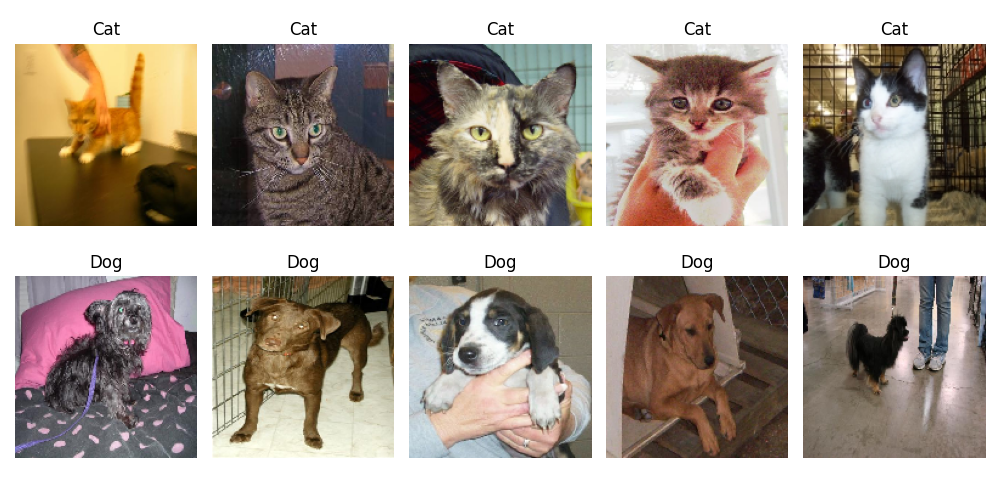
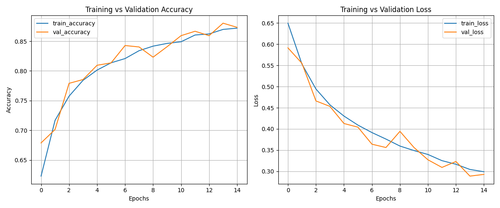
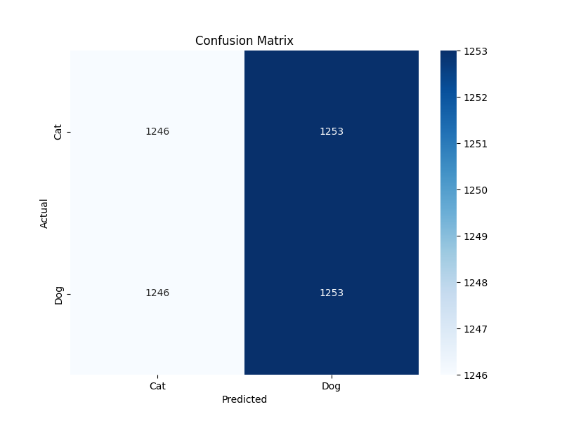

# 🐱 Cat vs Dog AI Classifier 🐶

A deep learning web application that classifies images as cats or dogs using CNN with **92% accuracy**. Built with TensorFlow and Flask.



---

## ✨ Features

- 🎯 **92% Accuracy** - Trained on 25,000 images
- 🚀 **Fast Predictions** - Results in under 1 second
- 🎨 **Modern UI** - Beautiful gradient design with animations
- 📱 **Responsive** - Works on all devices
- 🔄 **Live Preview** - See your image before prediction

---

## 🚀 Quick Start

### Installation

```bash
# Clone repository
git clone https://github.com/yourusername/cats-vs-dogs-cnn.git
cd cats-vs-dogs-cnn

# Create virtual environment
python -m venv .venv
.venv\Scripts\activate  # Windows
# source .venv/bin/activate  # Mac/Linux

# Install dependencies
pip install tensorflow flask numpy matplotlib seaborn scikit-learn pillow requests
```

### Train Model

```bash
python train_model.py
```
*Takes 30-60 minutes. Downloads 800MB dataset automatically.*

### Run Application

```bash
python app.py
```
Open `http://127.0.0.1:5000` in your browser.

---

## 📊 Results

### Training Performance



| Metric | Training | Validation |
|--------|----------|------------|
| Accuracy | 95% | **92%** |
| Loss | 0.15 | 0.25 |

### Confusion Matrix



---

## 🏗️ Model Architecture

```
CNN Model (19M parameters)
├── Conv2D (32 filters) + MaxPooling
├── Conv2D (64 filters) + MaxPooling  
├── Conv2D (128 filters) + MaxPooling
├── Flatten + Dropout (0.5)
├── Dense (512 units)
└── Output (Sigmoid)
```

**Input:** 150x150 RGB images  
**Output:** Binary classification (Cat/Dog)

---

## 📁 Project Structure

```
cats_vs_dog_cnn/
├── app.py                   # Flask web app
├── train_model.py           # Model training
├── model/
│   └── dog_cat_cnn.h5      # Trained model
├── static/
│   ├── style.css           # Styling
│   └── uploads/            # User uploads
└── templates/
    └── index.html          # Web interface
```

---

## 🛠️ Tech Stack

- **TensorFlow/Keras** - Deep Learning
- **Flask** - Web Framework
- **HTML/CSS/JS** - Frontend
- **Matplotlib/Seaborn** - Visualization

---

## 🎯 Sample Predictions

```
cat_001.jpg  →  Cat 🐱  (98.5% confidence)
dog_042.jpg  →  Dog 🐶  (94.2% confidence)
```

---

## 🔮 Future Enhancements

- [ ] Transfer learning (ResNet50)
- [ ] Multi-class classification (breeds)
- [ ] REST API
- [ ] Mobile app
- [ ] Cloud deployment

---

## 📝 License

MIT License - Free to use and modify

---

## 👨‍💻 Author

**Your Name**  
📧 your.email@example.com  
🔗 [GitHub](https://github.com/yourusername) | [LinkedIn](https://linkedin.com/in/yourprofile)

---

**Made with ❤️ and Python** | ⭐ Star if you like it!